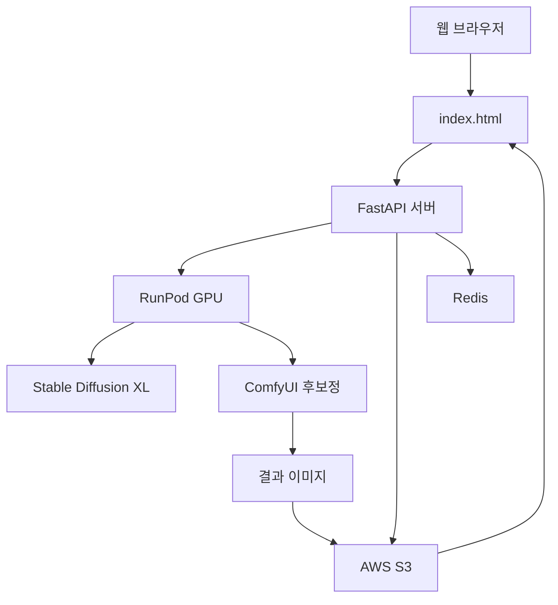

# 🎨 AI 헤어 스타일 변경 서비스

마스킹 기반으로 정확한 헤어스타일 변경을 제공하는 AI 웹앱


## ✨ 주요 기능

- 🎯 **정밀 마스킹**: 사용자가 직접 변경할 영역을 정확히 지정
- 🔄 **스타일 전이**: 참조 이미지의 헤어스타일을 100% 복사
- 🖼️ **배경 보존**: 얼굴, 옷, 배경은 완벽하게 유지
- ✨ **고품질 후보정**: ComfyUI 스타일 실사 수준 결과
- 📱 **반응형 UI**: 모바일/데스크톱 모두 지원

## 🚀 빠른 시작

### 1. 프론트엔드 실행 (즉시 체험)

```bash
# 로컬에서 바로 실행
python -m http.server 8080
# 또는
npx serve .

# 브라우저에서 http://localhost:8080 접속
```

### 2. 백엔드 설정 (전체 기능)

```bash
# 1. 프로젝트 클론
git clone https://github.com/yourusername/hair-style-transfer.git
cd hair-style-transfer

# 2. 백엔드 환경 설정
cd backend
python -m venv venv
source venv/bin/activate  # Windows: venv\Scripts\activate
pip install -r requirements.txt

# 3. 환경변수 설정
cp .env.example .env
# .env 파일에서 API 키들 설정

# 4. 서버 실행
uvicorn main:app --reload --port 8000
```

### 3. AI 워커 배포 (RunPod)

```bash
cd ai-worker

# Docker 이미지 빌드 및 배포
docker build -t hair-transfer-ai .
docker tag hair-transfer-ai yourdockerhub/hair-transfer-ai
docker push yourdockerhub/hair-transfer-ai

# RunPod에서 서버리스 엔드포인트 생성
```

## 🔑 필수 API 키 설정

### 1. RunPod API Key
- [RunPod 콘솔](https://runpod.io/console)에서 API 키 생성
- Serverless 엔드포인트 생성 후 엔드포인트 ID 복사

### 2. AWS S3 (이미지 저장)
- AWS 계정에서 S3 버킷 생성
- IAM에서 S3 접근 권한 있는 사용자 생성

### 3. Redis (작업 큐)
- [Redis Cloud](https://redis.com/try-free/) 무료 계정
- 또는 로컬 Redis 서버 실행

### .env 파일 예시
```bash
RUNPOD_API_KEY=your_runpod_api_key_here
RUNPOD_ENDPOINT=your_endpoint_id_here
AWS_ACCESS_KEY_ID=your_aws_access_key
AWS_SECRET_ACCESS_KEY=your_aws_secret_key
AWS_BUCKET_NAME=your_s3_bucket_name
REDIS_URL=redis://localhost:6379
```

## 📖 사용법

### 1단계: 시드 이미지 업로드
- 얼굴, 배경, 옷을 유지할 기본 사진 업로드
- **빨간색 브러시**로 변경하고 싶은 헤어 부분을 정확히 칠하기

### 2단계: 참조 이미지 업로드  
- 원하는 헤어스타일이 있는 사진 업로드
- **초록색 브러시**로 복사할 헤어 부분을 정확히 칠하기

### 3단계: 처리 및 결과
- '헤어 스타일 변경하기' 버튼 클릭
- 30-60초 후 결과 확인 및 다운로드

## 🏗️ 시스템 아키텍처



## 💰 예상 비용

### 개발/테스트 단계
- **프론트엔드**: 무료 (GitHub Pages)
- **백엔드**: $5/월 (Railway/Render)
- **RunPod**: $0.01/처리 (테스트용)
- **총계**: ~$10/월

### 프로덕션 (월 1000건 처리)
- **RunPod GPU**: $10 (1000건 × $0.01)
- **AWS S3**: $5 (스토리지 + 트래픽)
- **Redis**: $0 (무료 티어)
- **총계**: ~$15/월

## 🛠️ 기술 스택

### 프론트엔드
- **HTML5 + Vanilla JavaScript**: 의존성 없는 순수 웹앱
- **Fabric.js**: 캔버스 기반 마스킹 도구
- **Responsive CSS**: 모바일 친화적 UI

### 백엔드
- **FastAPI**: 고성능 Python API 프레임워크
- **Redis**: 작업 큐 및 상태 관리
- **AWS S3**: 이미지 파일 저장소

### AI 처리
- **Stable Diffusion XL Inpainting**: 핵심 이미지 생성 모델
- **GFPGAN**: 얼굴 품질 향상
- **Real-ESRGAN**: 전체 이미지 품질 향상
- **RunPod Serverless**: GPU 서버리스 컴퓨팅

## 📱 데모 사이트

[🌐 Live Demo](https://your-demo-site.netlify.app)

*데모에서는 샘플 이미지로 기능을 체험할 수 있습니다*

## 🤝 기여하기

1. Fork the Project
2. Create your Feature Branch (`git checkout -b feature/AmazingFeature`)
3. Commit your Changes (`git commit -m 'Add some AmazingFeature'`)
4. Push to the Branch (`git push origin feature/AmazingFeature`)
5. Open a Pull Request

## 📄 라이선스

이 프로젝트는 MIT 라이선스를 따릅니다. 자세한 내용은 `LICENSE` 파일을 참조하세요.

## 📞 지원 및 문의

- 🐛 **버그 리포트**: [Issues](https://github.com/yourusername/hair-style-transfer/issues)
- 💡 **기능 제안**: [Discussions](https://github.com/yourusername/hair-style-transfer/discussions)
- 📧 **이메일**: your.email@example.com

## ⭐ Star History

[](https://star-history.com/#yourusername/hair-style-transfer&Date)

---

**만든 이**: [Your Name](https://github.com/yourusername)  
**라이선스**: MIT  
**버전**: 1.0.0
